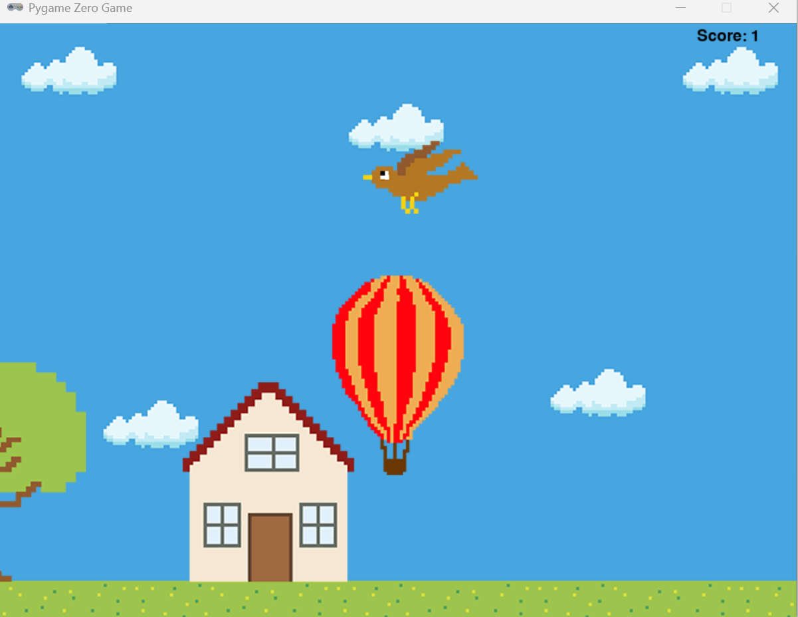

# Air Balloon Game

## Description

Air Balloon Game is a fun, simple Python game where you control a balloon as it floats through the sky, avoiding obstacles like birds, houses, and trees. The goal is to stay afloat as long as possible and achieve the highest score!

This game was built using the `pgzrun` library, a framework for writing 2D games in Python.

## How to Play

1. **Objective**: Avoid obstacles like birds, houses, and trees while keeping the balloon afloat.
2. **Control**: 
   - Click on the screen to make the balloon rise.
   - Release the mouse to allow the balloon to fall.
3. **Score**: Every time the bird crosses the screen or the house/tree moves off the screen, you score a point.
4. **Game Over**: The game ends if the balloon collides with any obstacle or goes out of bounds (too high or too low).
5. **High Scores**: After the game is over, your score will be compared to previous high scores stored in the game. You can view your rank in the high score list.

## Installation Instructions

To run this game, you'll need Python installed on your system. The game uses the `pgzrun` library, so you'll also need to install it.

### Steps to install:

1. Clone this repository to your local machine.
   
   ```bash
   git clone https://github.com/yourusername/air-balloon-game.git
   cd air-balloon-game
``

2. Install the required dependencies:

   ```bash
   pip install pgzrun
   ```

3. Run the game:

   ```bash
   python balloon.py
   ```

## Screenshot



